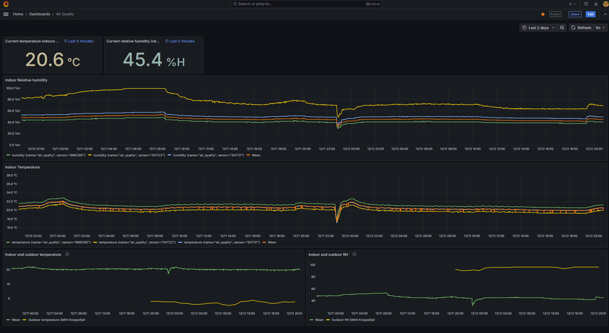

Docker must be installed.

Suggested order of setting up this stack first time:

1. Run the prerequisites.sh script
2. Create the files required for influxdb compose_first_init.yaml in folder influxdb/, and optionally modify location of data to anywhere you want to store your persistent data in the compose.yaml and compose_first_init.yaml
2. Navigate to influxdb and run prerequisites.sh and set up your influx database. Save the API key that you receive! It is only shown once
3. Optionally modify location of grafana persistent data as well in grafana/comose.yaml
4. Navigate to grafana/ and start grafana with the 'docker compose up -d' command
6. Configure grafana user/password, and add the data source. The IP of influx db will be the docker internal network IP of the service, since the two are created with a network option in the docker compose files. The IP is found by typing 'docker network inspect influxdb_nk'

Done! Now you can start sending data to influx and create dashboards in grafana. Easiest way to stop and start services is to navigate to either grafana/ or influxdb/ and run 'docker compose down' or 'docker compose up -d' respectively.

Below is an example of my setup with grafana, based on the dashboard json available in grafana/

